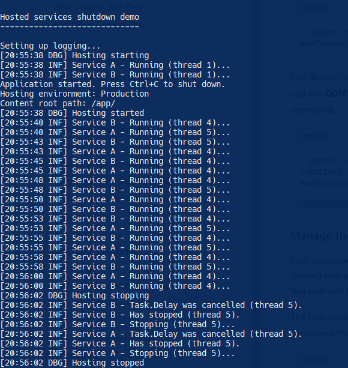

# explore-hosted-services

Small program to explore hosted services shutdown in Windows and Docker.

To test in Docker, from the solution folder run:

```powershell
.\docker-build-and-run.ps1
```

Let the build complete and the container to run for a while and then run this command from another console window:

```powershell
docker stop hostedservices
```

You should see something like this:


